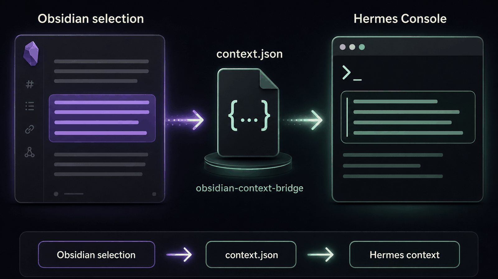

# Hermes Console

[](https://github.com/dannyshmueli/obsidian-hermes-console/releases)
[](https://obsidian.md)
[](https://github.com/dannyshmueli/obsidian-hermes-console/issues)
[](https://github.com/dannyshmueli/obsidian-hermes-console/issues?q=is%3Aissue+is%3Aclosed)
[](https://github.com/dannyshmueli/obsidian-hermes-console/releases)
[](https://github.com/dannyshmueli/obsidian-hermes-console/stargazers)
[](LICENSE)
[](https://discord.gg/sbMg6PP2vq)


Hermes Console brings the [Hermes Agent](https://github.com/NousResearch/hermes-agent) workflow into [Obsidian](https://obsidian.md). It gives your vault a real embedded terminal, launches `hermes` by default when the Hermes CLI is installed, and can hand selected note context or cursor context to the Hermes turn without copy-paste.

<p align="center">
  
</p>

Highlight a paragraph in Obsidian, press Enter in Hermes Console, and ask Hermes to rewrite, sharpen, research, or challenge that exact text. Selection in Obsidian becomes context in Hermes.

Already use Hermes? Install Hermes Console with BRAT: add `dannyshmueli/obsidian-hermes-console`, enable it, click **Download binaries**, open the console, and press Enter on your next Hermes prompt. The Hermes-side plugin appears as `obsidian-context-bridge`; that is expected and no extra Obsidian plugin is needed.

Full install instructions: https://github.com/dannyshmueli/obsidian-hermes-console#installation

Hermes Console is built on a fork of Lean Terminal. We preserve upstream credit and license history, but this README now describes the Hermes Console product, roadmap, and Obsidian-to-Hermes workflow.

## Quick start

### If you already use Hermes

1. Install the [BRAT](https://github.com/TfTHacker/obsidian42-brat) Obsidian plugin.
2. In Obsidian, open **Settings > BRAT > Add Beta Plugin**.
3. Paste `dannyshmueli/obsidian-hermes-console`.
4. Enable **Hermes Console** in **Settings > Community Plugins**.
5. Open **Settings > Hermes Console > Download binaries** and click **Download**.
6. Open Hermes Console from the ribbon icon or command palette.
7. Highlight text in any note, type a prompt in Hermes Console, and press Enter.

Hermes Console does not install Hermes itself. If `hermes` is already available in your shell, new console tabs start Hermes automatically.

### If you are new to Hermes

1. Install Hermes Agent from https://github.com/NousResearch/hermes-agent.
2. Run `hermes setup` in your normal terminal and confirm `hermes` starts.
3. Install Hermes Console with the BRAT steps above.
4. Open Hermes Console inside Obsidian and start working from your notes.

## Architecture: one Obsidian plugin, one Hermes plugin, one bridge file

Hermes Console has three pieces. They are separate on purpose:

1. **Obsidian plugin: Hermes Console**
   - This repository's visible Obsidian plugin.
   - Owns the terminal UI, tabs, PTY sessions, Obsidian commands, settings, safe tab close, and note-context status header.
   - Captures selected text or cursor context from the active Obsidian note when you press Enter in a Hermes terminal.

2. **Bridge file: `.obsidian/hermes/context.json`**
   - A local JSON handoff file written by the Obsidian plugin inside the active vault.
   - Plain Enter writes a fresh marker before the PTY receives Enter.
   - It is not a plugin, not a background service, not clipboard paste, and not an Obsidian-to-Hermes network connection.

3. **Hermes plugin: `obsidian-context-bridge`**
   - Repo-provided Hermes-side plugin loaded by the Hermes process launched inside the terminal.
   - Appears in Hermes Plugins as `obsidian-context-bridge`; that is correct. It is not a second Obsidian plugin.
   - Reads `OBSIDIAN_CONTEXT_BRIDGE_PATH` or an explicit bridge path.
   - Uses `pre_llm_call` to inject the current selected-text/cursor context into the active Hermes turn and exposes `obsidian_context()` for large selections.

So: **this is not two Obsidian plugins.** It is one Obsidian plugin plus one Hermes plugin connected by one JSON bridge file.

End-to-end selected-text/cursor behavior requires all three pieces: Obsidian capture, bridge file write, and the `obsidian-context-bridge` Hermes plugin loading in the integrated Hermes process.

**Desktop only.** Requires Obsidian 1.5.0+.

## Features

### Terminal Core

- Full PTY terminal (not a simple command runner) with interactive shell support
- Auto-detects your shell: PowerShell 7 / Windows PowerShell / cmd.exe on Windows, `$SHELL` on macOS/Linux
- Startup command: fresh new tabs run `hermes` by default once the shell is ready if the Hermes CLI is installed and in PATH. Restored tabs and resume links do not re-run the startup command
- Clipboard support: Ctrl+V / Cmd+V paste, Ctrl+C / Cmd+C copy (with selection)
- Clickable URLs in terminal output
- Auto-resize as the panel resizes
- Shift+Enter inserts a newline without submitting (muscle memory for Hermes and Claude-style prompts)

### Tab Management

- Multiple Hermes tabs with icon rename, color-coding, and pinning support
- Drag tabs to reorder them in the tab bar
- Keyboard shortcuts: Next/Previous (with wrap-around), Jump to Tab 1-8, Jump to last - bindable under Settings > Hotkeys
- Tab bar positioning: Top (default), Left, or Right side for wide-monitor layouts

### Vault Integration

- Opens in vault root by default; command palette to open in the current file's folder; right-click any file or folder to open a terminal there
- Drag files from the Obsidian file explorer or Windows Explorer into the terminal to insert the absolute path (spaces auto-quoted)
- Wiki-link autocomplete: type `[[` in the terminal to pick any vault note and insert as a wiki-link, vault-relative path, or absolute path

### Search & Selection

- In-terminal search bar (Ctrl+Alt+F): match counter, case-sensitive toggle, and highlight decorations
- Copy on select: automatically copies selected text to the clipboard as you highlight

### Appearance & Configuration

- 12 built-in color themes (Obsidian Dark, Obsidian Light, Monokai, Solarized Dark, and more); extend or override via themes.json
- Custom background color override with color picker (match your vault theme)
- Customizable ribbon and panel tab icon (any Lucide icon name)
- Configurable: shell path, font size, font family, cursor blink, scrollback, panel location

### Sessions & Persistence

- Session persistence: tab names, colors, working directories, and scrollback are restored when Obsidian reopens
- Rescue recently closed tabs from the command palette (ring buffer of the last 10 sessions)
- Notification sounds when background tab commands finish (4 sound types, adjustable volume)
- Restore recently closed tabs and live Hermes CLI sessions from the command palette
- Optional Obsidian-to-Hermes context bridge for selected text or cursor context

### Hermes Context Bridge

- Global **Send Obsidian context to Hermes** toggle controls whether selected text or cursor context is attached to Hermes turns
- Selection wins when text is selected; otherwise cursor context can provide the current note location and nearby lines
- Context is captured at submit time, not pasted into the terminal, so multi-line selections do not break prompt entry
- The terminal process receives `OBSIDIAN_CONTEXT_BRIDGE_PATH` so the `obsidian-context-bridge` Hermes plugin can read the right vault bridge file
- Large selections can stay out of the prompt body and be fetched by Hermes through `obsidian_context()`

## Installation

Fast path while Community Plugins review is pending: install with BRAT, add `dannyshmueli/obsidian-hermes-console`, enable Hermes Console, then click **Settings > Hermes Console > Download binaries**.

The plugin needs native `node-pty` binaries after install. Community Plugins and BRAT users download them from plugin settings. Manual/local development installs them with `npm install` and copies them into the vault plugin directory with `install.mjs`.

Hermes Console does not install the Hermes CLI. Install Hermes separately if you want the default `hermes` startup command to work.

### Community Plugins (published releases)

Use this path when the Hermes Console plugin is available in Obsidian's Community Plugins directory.

1. Open **Settings > Community Plugins**
2. Search for "Hermes Console"
3. Click **Install**
4. Enable the plugin in **Settings > Community Plugins**
5. Go to **Settings > Hermes Console > Download binaries** and click **Download** to fetch the native `node-pty` binary for your platform
6. Open the console via the ribbon icon or command palette

The upstream community plugin remains available as [Lean Terminal](https://community.obsidian.md/plugins/lean-terminal).

### BRAT beta

Use this path for beta builds or if the Hermes Console plugin is not yet available in Community Plugins.

1. Install the [BRAT](https://github.com/TfTHacker/obsidian42-brat) plugin if you don't have it
2. Open **Settings > BRAT > Add Beta Plugin**
3. Enter: `dannyshmueli/obsidian-hermes-console`
4. Enable the plugin in **Settings > Community Plugins**
5. Go to **Settings > Hermes Console > Download binaries** and click **Download** to fetch the native `node-pty` binary for your platform
6. Open the console via the ribbon icon or command palette

### Manual/local development

1. Clone this repository
2. Run `npm install` to install dependencies, including local `node-pty`
3. Run `npm run build`
4. Run `node install.mjs "/path/to/vault"` to copy `main.js`, `manifest.json`, `styles.css`, the Hermes bridge plugin files, and `node-pty` into `.obsidian/plugins/hermes-console`
5. Restart Obsidian and enable the plugin in **Settings > Community Plugins**

### Verify the install

- Plugin is enabled in **Settings > Community Plugins**
- Native binaries are downloaded through plugin settings or copied by `install.mjs`
- Terminal opens from the ribbon icon or command palette
- Hermes CLI is installed separately and visible to Obsidian's PATH if you want Hermes autostart
- A new terminal tab starts `hermes` by default when Hermes is available in PATH
- If using note context: `<vault>/.obsidian/hermes/context.json` is updated when you press Enter in a Hermes terminal
- If using note context: the Hermes process has the `obsidian-context-bridge` plugin enabled and can receive `OBSIDIAN_CONTEXT_BRIDGE_PATH`

### Troubleshooting

If the console fails to open, check the `node-pty` native module first:

- Community Plugins or BRAT: run **Settings > Hermes Console > Download binaries** again
- Manual/local development: rerun `npm install`, `npm run build`, and `node install.mjs "/path/to/vault"`
- Restart Obsidian completely after fixing binaries or native module files

#### ARM64 Windows binary download

If you see "Failed to download binaries" on an ARM64 Windows device (Surface Pro X, Windows Dev Kit, etc.):

1. **Close all terminal tabs** in Obsidian (the binary may be locked in use)
2. **Disable the plugin** in Settings, then re-enable it
3. **Restart Obsidian** completely (not just reload)
4. **Manually delete** the plugin's `node_modules` folder: browse to `.obsidian/plugins/hermes-console/node_modules/` in your vault and delete it
5. **Try downloading binaries again**

If the issue persists, check that:

- You have write permissions to the plugin directory
- Your `.obsidian` folder is not synced to a cloud service (OneDrive, iCloud, Dropbox) that may lock files during sync
- Your antivirus software is not blocking file extraction

## How It Works

The plugin uses xterm.js for terminal rendering and node-pty for native pseudo-terminal support. node-pty spawns a real shell process (PowerShell, bash, etc.) and connects its stdin/stdout to xterm.js via Obsidian's Electron runtime. This gives you a fully interactive terminal - not just command execution.

On Windows, the plugin uses the ConPTY backend (correct UTF-8 and emoji support). A patched `windowsConoutConnection.js` replaces node-pty's Worker thread with inline socket piping so ConPTY works inside Obsidian's Electron renderer, which does not support Worker thread construction.

## Related documents

See [Usage](docs/usage.md) for the full command reference.

See [Settings](docs/settings.md) for all configuration options.

See [Session Persistence](docs/session-persistence.md) for how tab state is saved and restored.

See [Hermes Obsidian Context Bridge](docs/hermes-obsidian-context-bridge.md) for the optional context handoff.

See [URI Handler](docs/uri-handler.md) for the canonical `obsidian://hermes-console` protocol reference.

See [Security](docs/security.md) for the security review summary.

## Changelog

See [CHANGELOG.md](CHANGELOG.md) for release history and feature documentation by version.

## Feedback

Use this repo to report bugs, request features, or ask questions.

- [Report a Bug](https://github.com/dannyshmueli/obsidian-hermes-console/issues/new?assignees=&labels=bug&template=bug_report.md)
- [Request a Feature](https://github.com/dannyshmueli/obsidian-hermes-console/issues/new?assignees=&labels=enhancement&template=feature_request.md)
- [Report a Performance Issue](https://github.com/dannyshmueli/obsidian-hermes-console/issues/new?assignees=&labels=performance&template=performance_issue.md)
- [Ask a Question / Share Feedback](https://github.com/dannyshmueli/obsidian-hermes-console/discussions)

If you want to support my work, you can use this link to [buy me a drink](https://kspr.me/cheers) - thank you, I appreciate you.

## Development

```bash
npm install
npm run dev          # Watch mode (auto-rebuild on save)
npm run build        # Production build
node install.mjs     # Install to default vault (D:\LOS Test)
```

## Credits

Hermes Console began as a fork of [Lean Terminal](https://github.com/polyipseity/obsidian-lean-terminal), an open-source terminal plugin for Obsidian. Thank you to the Lean Terminal maintainers and contributors for the original terminal foundation.

This project has since diverged into Hermes Console: an Obsidian plugin for Hermes Agent, with its own UI, context bridge, settings, docs, and roadmap.

### Upstream Lean Terminal contributors

The following credits refer to contributions made in the upstream Lean Terminal project before or outside this fork:

- **[@FarhadGSRX](https://github.com/FarhadGSRX)** - Session persistence, session rescue buffer, original Claude Code session work in upstream Lean Terminal, color scheme catalog with themes.json support
- **[@ckelsoe](https://github.com/ckelsoe)** - Per-tab color tint customization with editable palette, wiki-link autocomplete with path-insertion modes
- **[@c00llin](https://github.com/c00llin)** - Terminal location options (Tab Right, Split Tab Right)
- **[@kkugot](https://github.com/kkugot)** - Emoji rendering fixes, system theme detection with terminal color reporting protocol
- **[@CHodder5](https://github.com/CHodder5)** - Zsh startup file forwarding (.zshenv and .zprofile) via ZDOTDIR override

### Hermes Console contributors

See this repository's commit history and releases for Hermes Console-specific contributors and changes.

## License

[MIT](LICENSE)
